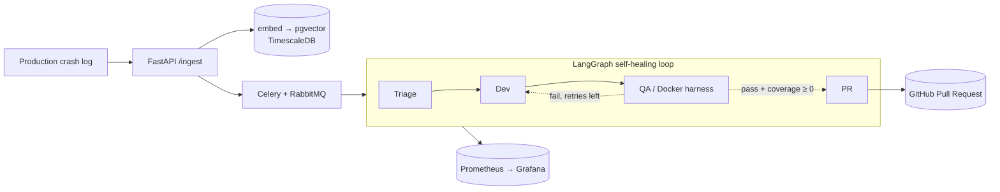
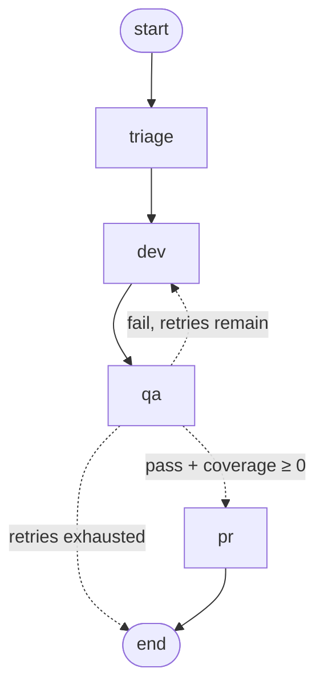
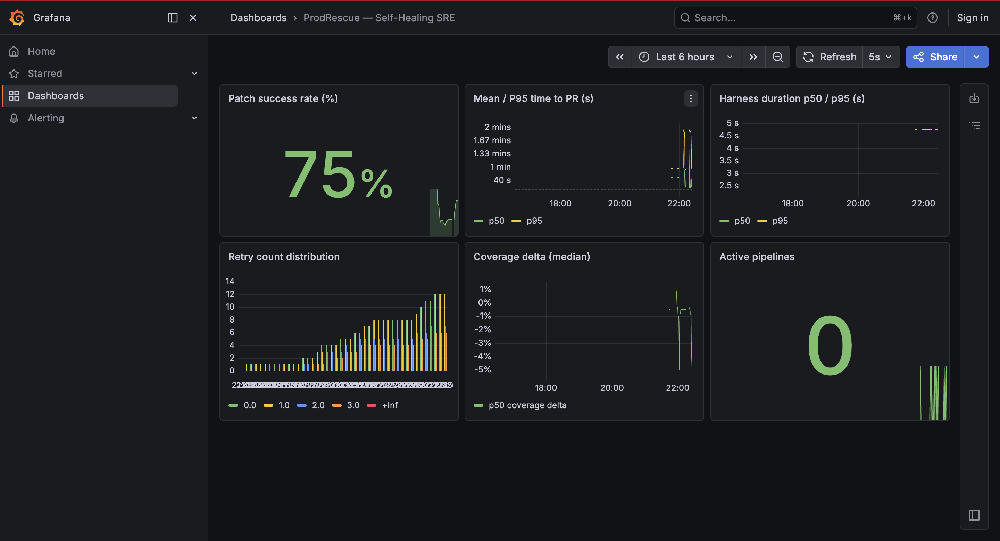

# ProdRescue — Self-Healing SRE Agent

> ProdRescue ingests a production error log, uses a multi-agent LLM pipeline to find the root cause
> and write a fix, validates that patch in an isolated Docker test harness, and opens a GitHub Pull
> Request — fully autonomously, with a self-correcting retry loop when a patch fails QA.


**See it actually work:**

- 👉 **[5 AI-authored fixes, merged into a live repo](https://github.com/BashaarJavaid/prodrescue-target-app/pulls?q=is%3Apr+is%3Amerged)**
  — each PR (root-cause analysis, unified diff, harness results) was written entirely by the agent.
- 👉 **[A public LangSmith trace of the agent self-healing](https://smith.langchain.com/public/e16ba235-3e26-4f13-85aa-da0b9534c117/r)**
  — one incident where the first two patches fail QA and the **third repairs the bug** and ships the PR.

---

## What it does

A production service throws an exception. Instead of paging a human, ProdRescue:

1. **Ingests** the crash via `POST /ingest`, embeds the message, and stores it in pgvector for
   semantic similarity search against past incidents.
2. **Triages** it — an LLM agent reads the stacktrace plus similar historical incidents and produces
   a structured root-cause analysis and a spec describing how to reproduce it.
3. **Writes a patch** — a Dev agent fetches the source from GitHub and generates the fixed file.
4. **Proves the fix** — a QA agent spins up an isolated, network-locked, resource-capped Docker
   stack, applies the patch, runs the test suite, and measures the coverage delta.
5. **Self-heals on failure** — if QA fails, the failure telemetry is fed back to the Dev agent and
   it tries again (up to a configurable retry budget).
6. **Opens a draft PR** — once the patch passes and coverage holds, it pushes a branch and opens a
   GitHub Pull Request with the diff, root cause, and harness results in the body.

It runs against a public target service,
[**`prodrescue-target-app`**](https://github.com/BashaarJavaid/prodrescue-target-app) — the repo
where the demo PRs above were opened.

## Architecture



The core is a LangGraph state machine, checkpointed to Postgres so a worker restart resumes
mid-incident. This is the actual compiled graph:



Each agent reaches external tools only through scoped **MCP servers** (least-privilege enforced at
the call site): Triage may search logs, Dev may read source, QA may drive Docker, PR may write to
GitHub — nothing else.

## Key design decisions

- **Provider-agnostic LLM** behind an OpenAI-compatible Instructor client (`services/agents/llm.py`).
  Default model: **Xiaomi MiMo-V2.5-Pro** — swap providers by changing `LLM_BASE_URL` / `LLM_MODEL` /
  `LLM_API_KEY` only.
- **Full-file patching, not fragile diffs.** The Dev agent emits the complete fixed file; the harness
  writes it verbatim and the PR uploads it directly, sidestepping `git apply` rejections.
- **A real coverage gate.** The harness measures coverage on the pristine code, then on the patched
  code, and only opens a PR when the delta is non-negative — a patch that weakens the suite is
  blocked and retried.
- **A genuinely isolated harness.** QA sub-stacks run with `network_mode: none`, a memory/CPU/PID
  cap, dropped capabilities, and `no-new-privileges`, with deterministic `try/finally` teardown (no
  leaked containers or networks).
- **Semantic incident memory** via pgvector cosine similarity over TimescaleDB hypertables, surfaced
  to the Triage agent through a custom MCP server.
- **Production guardrails:** `/ingest` auth, a global concurrency cap, crash de-duplication,
  idempotent draft PRs, base-SHA-pinned writes, a diff-scope guard, LLM/MCP call timeouts, a `/ready`
  probe, and graceful (non-crashing) node-error handling.

## Observability

Five Prometheus metrics — patch success rate, retries per incident, time-to-PR, coverage delta, and
active pipelines — feed a version-controlled, auto-provisioned Grafana dashboard
(`infra/grafana/dashboards/prodrescue.json`), plus full LangSmith tracing of every agent run.



**Observed in a live run** against the target repo: 5 distinct production bugs (NoneType deref,
`KeyError`, `ZeroDivisionError`, `None`-token `TypeError`, empty-list `IndexError`) diagnosed, fixed,
and merged; ~75% patch success across all attempts (each retry counts as an attempt); typical
time-to-PR of 30–60s on CPU-only inference.

## Tech stack

| Layer | Tools |
|---|---|
| Orchestration | LangGraph (Postgres checkpointing), Instructor + OpenAI-compatible LLM (MiMo) |
| Tooling | Model Context Protocol (MCP) servers over streamable-HTTP |
| API / async | FastAPI, Celery, RabbitMQ, Redis |
| Data | PostgreSQL + TimescaleDB + pgvector |
| Test harness | Docker Compose (isolated per-incident stacks), pytest + coverage |
| Observability | Prometheus, Grafana, LangSmith |
| Infra (written, validated) | Terraform (EKS/RDS/ElastiCache/ECR), Kubernetes (HPA on queue depth), GitHub Actions CI |

## Run locally

Prereqs: Docker Desktop (Compose V2), Python 3.11+, and an OpenAI-compatible LLM endpoint.

```bash
cp .env.example .env          # set LLM_BASE_URL / LLM_API_KEY / LLM_MODEL
                              # GITHUB_TOKEN + REPO_FULL_NAME for real PRs (omit → dry-run to ./dryrun_prs)
docker compose up -d --build  # api, worker, both MCP servers, postgres, rabbitmq, redis, prometheus, grafana

docker compose exec api python scripts/seed_incidents.py        # backfill incidents for semantic search
scripts/inject_crash.sh scripts/crashes/01_payments_none.json   # inject a synthetic crash
docker compose logs -f worker                                   # watch triage → dev → qa → (retry) → pr
```

| Service | URL |
|---|---|
| FastAPI / Swagger | http://localhost:8000/docs |
| Grafana | http://localhost:3000 |
| Prometheus | http://localhost:9090 |
| RabbitMQ management | http://localhost:15672 |

## Tests

```bash
python -m venv .venv && source .venv/bin/activate
pip install -r requirements-dev.txt

EMBED_BACKEND=hash pytest tests/unit --cov=services --cov-fail-under=60   # 55 unit tests, no infra
RUN_INTEGRATION=1 pytest tests/integration -m integration                 # needs Docker (+ DB)
ruff check services/ tests/ scripts/ && mypy services/ --ignore-missing-imports
```

`EMBED_BACKEND=hash` uses a deterministic embedding backend so tests/CI never download model weights.

## Project layout

```
services/
  api/        main.py, tasks.py, embeddings.py, database.py, metrics.py, ratelimit.py
  agents/     graph.py, nodes.py, state.py, llm.py, mcp_clients.py, prompts.py, patching.py
  mcp_servers/harness/{server.py,compose.py}, logs_db/server.py
  schemas/    models.py            # HarnessSpec / HarnessResult / ErrorLog + LLM output models
infra/        db/init.sql, prometheus.yml, grafana/, main.tf, variables.tf, k8s/
sample_target/  the buggy "payments" service the pipeline diagnoses and patches
scripts/      seed_incidents.py, inject_crash.sh, crashes/*.json
tests/        unit/ (55), integration/ (2, gated by RUN_INTEGRATION=1)
```
